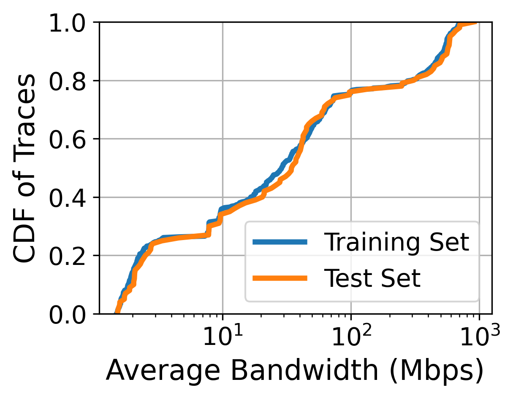

# Pensieve Retraining
This repository provides a reproducible method for retraining the [Pensieve](http://web.mit.edu/pensieve/) model, including the following improvements based on the original Pensieve code:

- Support for **dynamic entropy weight**, i.e., decaying $\beta$ from 1 to 0.1 over $10^5$ iterations. Refer to: [Why the result is not better than MPC? · Issue #11 · hongzimao/pensieve](https://github.com/hongzimao/pensieve/issues/11).
- Train and test Pensieve under **higher video bitrate** (up to 4K resolution encoded at 40Mbps). Specifically,`VIDEO_BIT_RATE`, `REBUF_PENALTY`, and chunk size information in Pensieve, BBA , and RobustMPC are modified. The video ([Big Buck Bunny](https://peach.blender.org/)) is provided in `sim/` and `test/`.
- **Normalize states and rewards** for higher network bandwidth (e.g., in 5G networks) by an order of magnitude. Refer to: [godka/pensieve-5G: Pensieve for 5G datasets](https://github.com/godka/pensieve-5G).
- Carefully split the dataset into training and test sets in a repeatable way.
- Fix some bugs in the original code.

Please see the commits after `668f7ef1c3be7656d878771591ec93a865f4b1e0` (Jan 13, 2024) for details. 

Note: This repository only reports single-video simulation results. Potential issues may exist in the multi-video scenario, emulation, or real-world deployment, where the related code has not been modified. 

## Change description

Only files in three folders are changed: 

- `sim/`: dynamic entropy weight; new video; states and rewards normalization.
- `test/`: new video; states and rewards normalization.
- `retrained_info/`: information related to the retrained model, including:
  - `data_preprocess/`: network traces; scripts to filter and split the dataset (network traces)
  - `retrained_model/`: retrained model files
  - `training_info/`: training curves about the reward and TD loss; the central agent log
  - `test_results/`: performance of the retrained model versus BBA and RobustMPC

## Training and testing methodology
Pensieve's original training and testing procedure remains unchanged. Specifically, I used a TensorFlow v1.1.0 docker to run the programs. Best practices were provided by the authors:

> `Ubuntu 16.04, Tensorflow v1.1.0, TFLearn v0.3.1 and Selenium v2.39.0`
>
> From: [Issue #12 · hongzimao/pensieve](https://github.com/hongzimao/pensieve/issues/12#issuecomment-345060132)

**Decaying entropy weight.** As described in the Pensieve paper, "the entropy factor $\beta$ is controlled to decay from 1 to 0.1 over $10^5$ iterations". However,  this value is constant during training in the original code (`ENTROPY_WEIGHT = 0.5` in `sim/a3c.py`). I used a stepwise method to decrease the entropy weight (by 0.09 every 10000 iterations). This is implemented by modifying `sim/a3c.py` and `sim/multi_agent.py`. In detail, the entropy weight is set as a `placeholder` in `a3c.py` to make it changeable. During training, `multi_agent.py` adjusts its value according to the number of epochs, and passes the value to `a3c.py`. 

**Network traces.** Four classes of wireless bandwidth traces are used in training and testing, collected in 3G, 4G, 5G, and Wi-Fi networks. Each class of traces is further divided into several types, depending on the location or mobility. I further filter out traces  (see `retrained_info/data_preprocess/filtered_traces.py`) whose average bandwidth is less than 1.5Mbps (because the lowest video bitrate is 1Mbps), mainly in the Norway FCC dataset. Final traces are provided in `retrained_info/data_preprocess/network_traces.zip`. 

|                 | Count | Range of Average Bandwidth (Mbps) |
| --------------- | ----- | --------------------------------- |
| Norway FCC (3G) | 134   | 1.51~4.59                         |
| Lumos4G         | 175   | 7.59~102.43                       |
| Lumos5G         | 121   | 66.49~906.09                      |
| Solis Wi-Fi     | 80    | 7.28~73.16                        |

Raw traces are publicly available: (however, the unit may be inconsistent)

- Norway FCC (3G)  : [transys-project/pitree/traces.zip](https://github.com/transys-project/pitree/blob/master/traces.zip)
- Lumos4G: [SIGCOMM21-5G/artifact/Video-Streaming/Network-Traces/Lumous5G/4G](https://github.com/SIGCOMM21-5G/artifact/tree/main/Video-Streaming/Network-Traces/Lumous5G/4G)
- Lumos5G: [SIGCOMM21-5G/artifact/Video-Streaming/Network-Traces/Lumous5G/5G](https://github.com/SIGCOMM21-5G/artifact/tree/main/Video-Streaming/Network-Traces/Lumous5G/5G)
- Solis Wi-Fi: [GreenLv/Solis-WiFi-Trace](https://github.com/GreenLv/Solis-WiFi-Trace)

**Dataset splitting.** When retraining the Pensieve model, the dataset is split into training and test sets at a ratio of 0.8:0.2. This split is _random and uniform_, depending on each type in each class of all traces. See `retrained_info/data_preprocess/split_trian_test.py` for details. 

Training and test set distribution (average trace bandwidth):
|             | Count | Avg (Mbps) | Std (Mbps) | Min (Mbps) | Max (Mbps) |
| ----------- | ----- | ----------- | ----------- | ----------- | ----------- |
| Training Set | 410   | 128.91      | 203.60 | 1.51 | 749.23 |
| Test Set    | 100   | 139.95      | 222.06 | 1.54 | 906.09 |

    

## Retrained model information

The model is training for 109,900 iterations, taking 7 hours and 44 minutes. 

    
    

## Testing results

BBA ("sim_bb") and RobustMPC ("sim_mpc") are evaluated on the same test set. It can be seen that the retrained Pensieve model ("sim_rl") successfully outperforms these two algorithms, in terms of the average QoE score (5.7% to 28.9% higher). 

    
    

